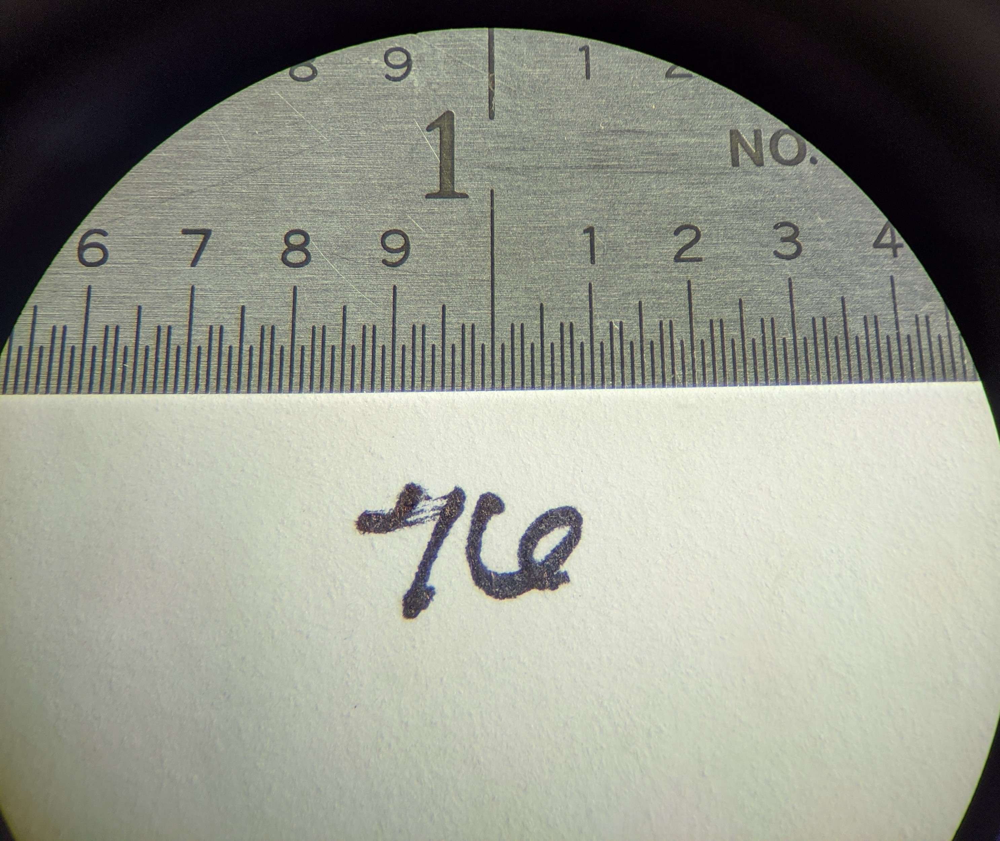

# Measuring seeds using Fiji and other distributions of imageJ
By: Ian C. Anderson <iananderson@berkeley.edu> 

1. [Required Materials](#Required-Materials)
2. [Getting Started](#Getting-Started)
3. [Analysis](#Analysis)
    1. [Scaling Images](#Scaling-Images)
    2. [Threshhold optimization](#Threshhold-optimization)
    3. [Measuring Seeds](#Measuring-Seeds)
 4. [Data Cleanup](#data-cleanup)
 5. [Troubleshooting](#troubleshooting)
 6. [Advanced Ideas](#advanced-ideas)
 7. [Acknowledgements](#Acknowledgements)
## Required Materials
[Back to the top](#Measuring-seeds-using-Fiji-and-other-distributions-of-ImageJ)
1. A computer with Windows, MacOS, or Linux.
    1. The Python Operating system(Optional, largely unneccesary)  
2. A camera or smartphone with a camera
3. A ruler
4. A stand or other apparatus able to hold camera at consistence distance (very important!)
5. A microscope (optional, but recommended)
6. A copy of ImageJ, Fiji, or any other distribution of ImageJ 2.0 or above.

## Getting Started
[Back to the top](#Measuring-seeds-using-Fiji-and-other-distributions-of-ImageJ)
1. The most important part of the image measuring process is collecting good, high quality images.
    1. Even lighting, a high contrast background, a clean workspace free of dust and other non-seed related plant parts are all highly recommended.
        1. Most importantly, having these factors consistent across all images is recommended.
        2. While almost any image can be measured, having variable lighting or contrast between different images will make batch processing difficult if not impossible.
2. Here are a few examples of well taken seed images. 

  

Note the even lighting and high contrast. 

3. Here are a few examples of poorly taken seed images.

  

Note the blurry image quality, poor lighting, bad contrast and light bleed from a source light that is too bright

4. It is important while taking images to have a ruler for scale. 
    1. In a perfect world the height between your camera and the subject of your photos will never change. 
    2. We don't live in a perfect world. There will be variablity with how your image is scaled(In one image, a single pixel might be .01mm, while in another it might be .015mm.
    3. Having a ruler in every picture, or taking a picture of a ruler every few pictures is a great way to keep on track.
    4. We have found the sweet spot to be taking a picture of a ruler every 6 images. 
        1. This doubles as a great way to keep track of image IDs.
        2. On most smartphones it is incredibly time consuming to rename or tag images with any useful information. If the order of the seeds is known, it is trivial to rename images based on the order at which the images come in, and taking a picture of a ruler, with a the number in the list the next or last seed image taken was is a great way to help keep yourself on track!
    5. Here is an example of a good image of a ruler.
    
     
Note how the ruler is straight, the measuring incraments are easy to understand, and the order number is easy to read.    

5. Once you have good images. You are ready to start analyzing!
## Analysis
### Scaling Images
[Back to the top](#Measuring-seeds-using-Fiji-and-other-distributions-of-ImageJ)
* There are multiple methods to accomplish this, but we will discuss the method using Fiji/ImageJ. Photoshop is useful and fast, but is prohibitively expensive to many users. Gimp is another free alternative.

1. The first step of the process is manaual. You need to measure your rulers.
2. Open the image of your scale in ImageJ
    1. From within ImageJ click the straight line tool(denoted in red) and mark the two pounds between a known point on your ruler. 
        1. Sometimes it is helpful to zoom in to your image to ensure you are hitting the right points. This won't effect the measurement. 
    2.  ImageJ ➡️ Analyze ➡️ Set Scale  
     
    
    3. You will be shown the following screen. Record "Distance in Pixels". The known distance is what ever you chose on your ruler. In our the case of the above example, our known distance would be 1/10th of an inch or 2.54mm. 
    
     
    
    4. Do this for all of your scales.
        1. Ideally, you will see <1% variance between your scales.
        2. This is ideal. In situations like these, we average all of the scales togehter and use this number for final analysis. 
        3. In situations where this is not the case, it is recommended you analyze your seeds in batches where the scale is similar. A worked around is seen in the [advanced ideas section](#advanced-ideas)
### Threshhold optimization  
[Back to the top](#Measuring-seeds-using-Fiji-and-other-distributions-of-ImageJ)
* Different light sources, and different backdrops are going to produce vastly different levels of contrast between your seeds and what is behind them. For instance, while a standard weigh boat and a piece of printer paper are both white; the weigh boat's slight opacity causes it to appear darker on camera than it does to the eye. This is not a problem, but we must figure out the appropraite threshhold for our images. 

* The threshhold in the included script is set to 168/255. We have found this to be a sweet spot for most images.

**To determine the optimal threshold for your seeds:**
1. Open an image you want to use.
2. ImageJ ➡️ Type ➡️ 8-bit - To convert the image to an 8-bit image.  

 
3. ImageJ ➡️ Adjust ➡️ Threshhold - To open the Threshhold menu.   

 

4. From here, you will be given a slider where you can test different threshholds to find what fits best with your seeds. Your goal is to get it to a point where the seeds (or other plant material) are easily differentiable from the background. Let's take a look at the following example images.

  

 Depending on your screen size, it might be hard to look at the subtle differences between these images. The you can always click on an image to view it in full size, but the browser extension "Hoverzoom" may be useful. 

1. In the first image, we see an example of what happens when you undershoot your threshhold. While it is the cleanest looking image of the set, you'll notice the seeds circled in blue are smaller than they are in the other images, and the seed circled in yellow is missing some information coming from the center. If you were to use this threshhold you would get accurate *seeming* data, but the your areas would be smaller than they should be. While if you're just looking at distributions of seed size within a group, and knowing the exact measurement is irrelevant, this might not be an issue, I would err on the side of caution as not all seeds may be under measured to the same degree. 

2. In the second image we see the exact opposite, the threshhold is too high, and the image appears to show information that is not there. Circled in red, you'll see parts in the background which are showing through, this could be caused by dust, or minor dark spots due to light flickers or any other factor causing the background to have differentntial lighting. Circled in green, we see seeds that are merging with their backgroun. The computer is likely considering the shadows cast by the seeds as part of the seed. In the seed circled in blue, it is less obvious what is wrong. Are we seeing the same thing as the first image where data is missing? Or are we seeing what we saw in the green circled seeds? We can't know, so we should really reject this threshhold.
    
3. In the final image, we see a good threshhold level. While it is not perfect, note the red circled parts of the background that come through, it is very easy to remove these remnents during the measuring process. 

### Measuring Seeds
[Back to the top](#Measuring-seeds-using-Fiji-and-other-distributions-of-ImageJ)
* ImageJ is a robust software package. With an endless number of ways to analyze images, a user is able to make subtle changes to customize their workflow. In this guide, I will focus on using ImageJ's GUI to batch process the images. This was the method utalized in `Population responses to a historic drought across the range of the common monkeyflower (Mimulus guttatus)`. More advanced methods utalizing ImageJ's python scripting will be found in [advanced ideas section](#advanced-ideas)

1. ImageJ ➡️ Process ➡️ Batch ➡️ Macro - to open the batch processing window.

 
2. Open the script using any text editing app and change the values for `D = the distance in pixels, K = What you know the distance represents U = the unit of measurement. ` with the measurements you've taken from the scale. 

3. In the batch process window, open the script in the script folder. Then select your input and output directories. In the included examples that would be /example_images/raw/ and /example_images/analyzed

 

4. Click process, and ImageJ will take care of the rest. Save the results File ➡️ Save.
    1. ImageJ will create a summary table, while helpful for use at a glance it is mostly unnecessary, as summary statistics can always be calculated later. 

## Data Cleanup
[Back to the top](#Measuring-seeds-using-Fiji-and-other-distributions-of-ImageJ)
* Now that you have your data, you need to ensure that the data is accurate.
1. Your output folder will be populated with a visual representation of where imageJ chose where an edge was in the image.
    1. Additionally, all seeds will be given a numeric label to easily search the data sheet.
2. It is a good practice to look through the output images and look for instances where imageJ is considering something to be a seed when it's not. Remnents as discribed in [Threshhold optimization](#Threshhold-optimization) are a common issue, but non-seed plant material, or other non-seed objects may be included. 
3. Any seeds that were improperly measured, or non-seed objects that were measured should be removed. 
    1. Once you have the seed number, you can easily remove that line from the results sheet.
4. Below are some images of seeds that need to be removed. 

  

Here are some common examples of issues that can come up in the analysis.
1. In the first image, we have two seeds that were too close together, so the software considered them one seed. Typically, have a dark shadow between the two of them which seems like a continuation of the seed. 

2. Here we have random noise which was considered a seed. This is likely one of the light remnents discussed in [Threshhold optimization](#Threshhold-optimization).

3. Here we have the crease in the weighboat that was used as a back drop casing a shadow in itself. 

There are programatic ways to deal with many of these issues, all of which discussed in [Advanced Ideas](#advanced-ideas)

## Troubleshooting
[Back to the top](#Measuring-seeds-using-Fiji-and-other-distributions-of-ImageJ)

## Advanced Ideas
[Back to the top](#Measuring-seeds-using-Fiji-and-other-distributions-of-ImageJ)

## Acknowledgements
[Back to the top](#Measuring-seeds-using-Fiji-and-other-distributions-of-ImageJ)

 
